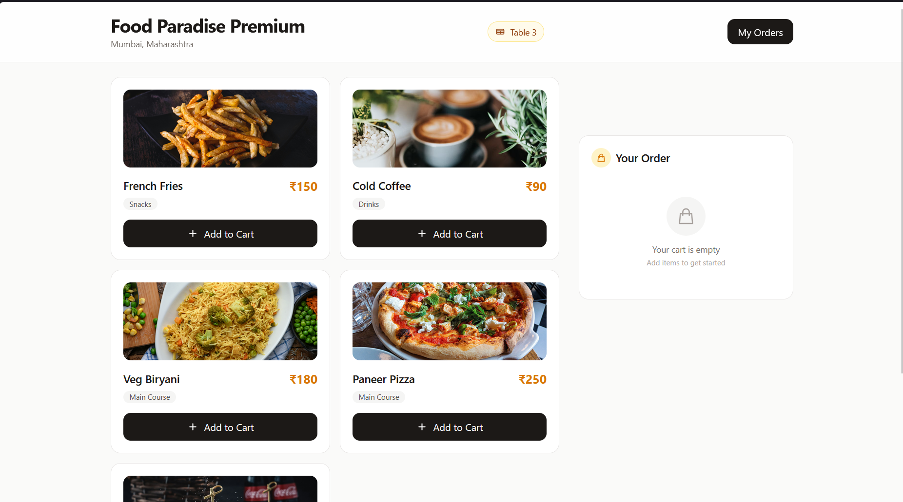
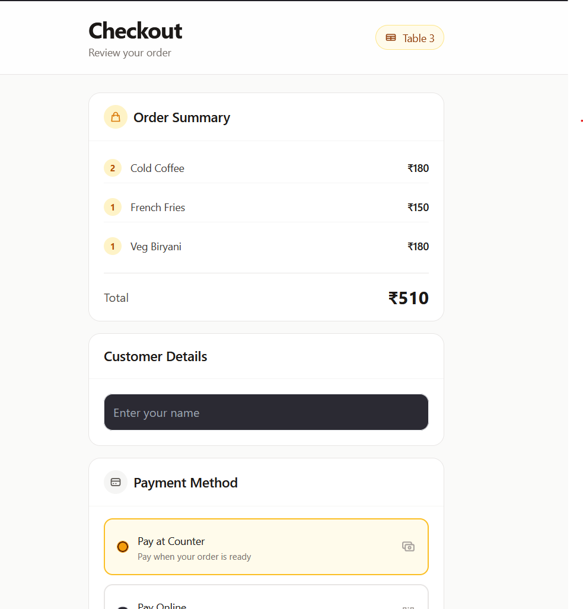
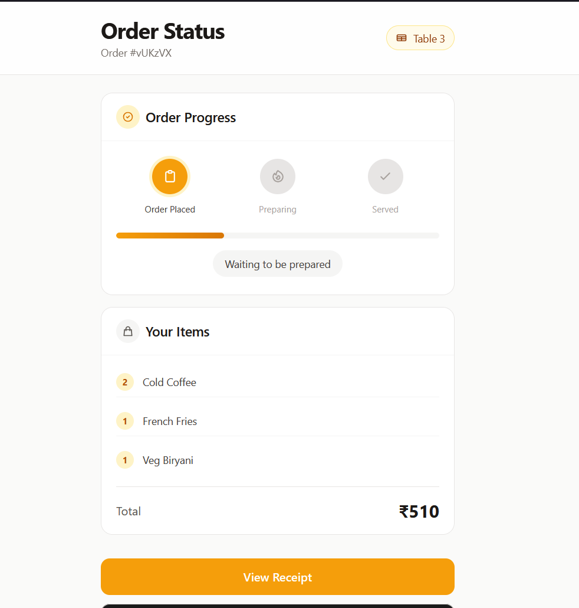
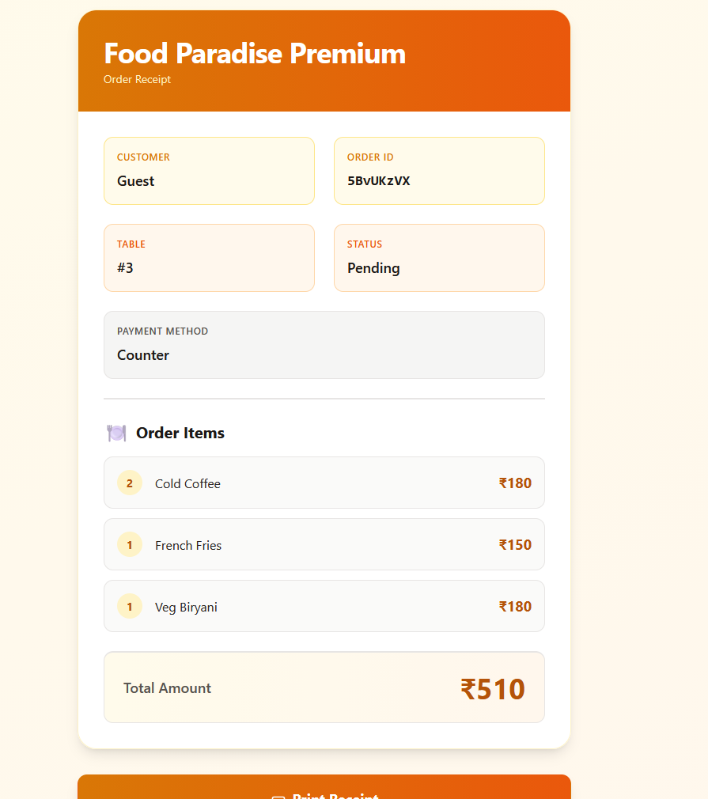
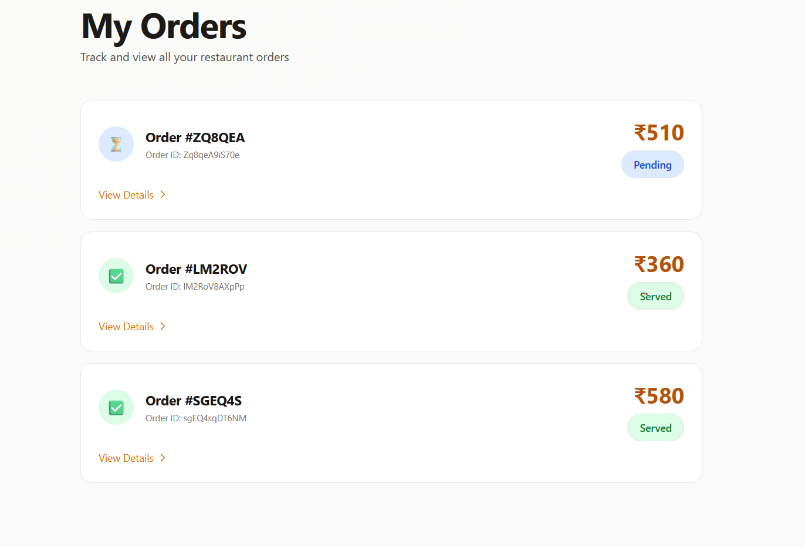
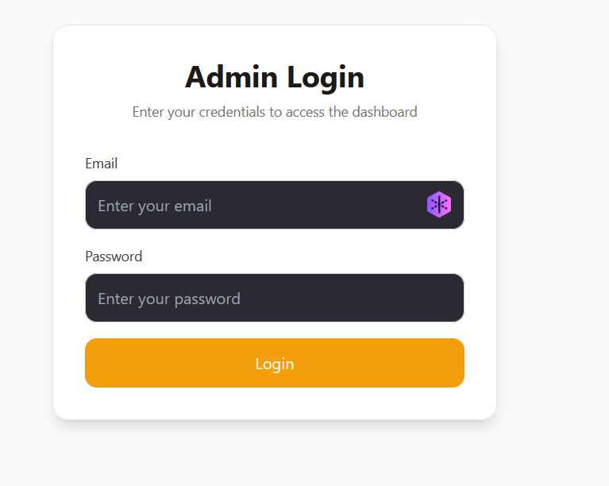
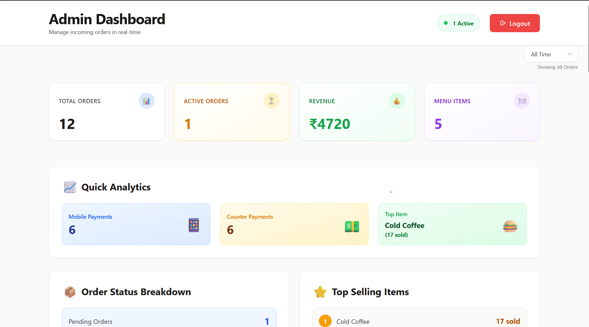
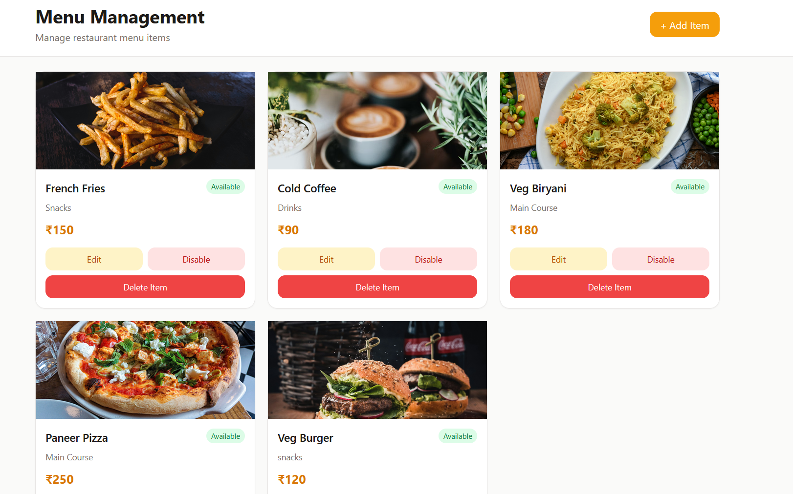
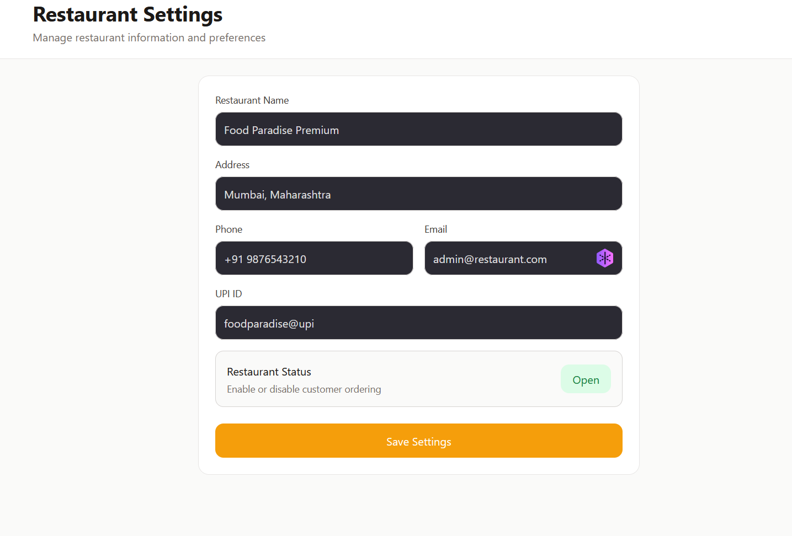
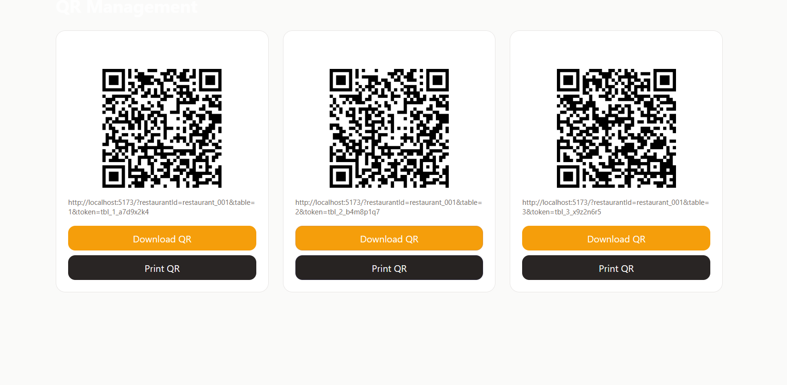

# Restaurant QR Ordering & Management System

A modern QR-based restaurant ordering and management platform built using React, Firebase, and Tailwind CSS.

Customers can scan a QR code placed on a restaurant table, browse the menu, place orders, track order status, view receipts, and access their order history. Restaurant administrators can manage menu items, monitor orders in real time, generate table QR codes, analyze sales data, and control restaurant settings through a secure admin dashboard.

---

## Features

### Customer Features

* QR Code Based Ordering
* Secure QR Token Validation
* Digital Menu Browsing
* Cart Management
* Checkout System
* Multiple Payment Options

  * Pay at Counter
  * Online Payment (Demo)
* Real-Time Order Tracking
* Order History
* Digital Receipts
* Printable Receipts
* Restaurant Open/Closed Status Handling

### Admin Features

* Secure Admin Authentication
* Protected Admin Routes
* Order Management Dashboard
* Menu Item Management

  * Add Items
  * Edit Items
  * Enable/Disable Availability
* Restaurant Settings Management
* QR Code Generation
* QR Code Download & Printing
* Sales Analytics Dashboard

### Analytics Features

* Revenue Tracking
* Order Statistics
* Payment Method Analysis
* Top Selling Items
* Order Status Distribution

### Security Features

* Firebase Authentication
* Protected Admin Routes
* Firestore Security Rules
* Secure QR Token Validation
* Restaurant-Specific Data Access

---

## Technology Stack

### Frontend

* React 19
* React Router DOM
* Tailwind CSS
* Vite

### Backend & Database

* Firebase Firestore
* Firebase Authentication

### Additional Libraries

* qrcode.react

---

## Project Architecture

Customer Flow

QR Code Scan
→ Menu
→ Cart
→ Checkout
→ Order Status
→ Receipt
→ Order History

Admin Flow

Admin Login
→ Dashboard
→ Orders
→ Menu Management
→ Restaurant Settings
→ QR Management
→ Analytics

---

## Firebase Collections

### restaurants

Stores restaurant information and settings.

Fields:

* name
* description
* isActive
* address
* contact

### tables

Stores table information and QR token data.

Fields:

* tableNumber
* restaurantId
* token
* tokenExpiry
* isActive

### menuItems

Stores food and beverage items.

Fields:

* name
* category
* description
* price
* image
* available
* restaurantId

### orders

Stores customer orders.

Fields:

* restaurantId
* tableId
* tableNumber
* customerName
* items
* total
* paymentMethod
* paymentStatus
* status
* createdAt
* statusUpdatedAt

---

## Installation

Clone the repository

```bash
git clone https://github.com/Srujan-Jangam/hotel-qr-ordering
cd hotel-qr-ordering
```

Install dependencies

```bash
npm install
```

Run development server

```bash
npm run dev
```

Build for production

```bash
npm run build
```

---

## Firebase Configuration

Create a Firebase project and enable:

* Authentication (Email/Password)
* Cloud Firestore

Create a Firebase configuration file:

```javascript
const firebaseConfig = {
  apiKey: "...",
  authDomain: "...",
  projectId: "...",
  storageBucket: "...",
  messagingSenderId: "...",
  appId: "..."
};
```

---

## QR Ordering Workflow

1. Admin generates QR codes for restaurant tables.
2. Customer scans QR code.
3. Secure token validation verifies the table.
4. Customer browses menu and places order.
5. Order is stored in Firestore.
6. Admin updates order status.
7. Customer tracks progress in real time.
8. Receipt is generated after ordering.

---

## Screenshots

### Customer Interface

* Menu Page

* Checkout Page

* Order Tracking Page

* Receipt Page

* My Orders Page


### Admin Interface

* Admin Login

* Dashboard

* Menu Management

* Restaurant Settings

* QR Management


---

## Future Enhancements

* Multi-Restaurant Support
* Razorpay Integration
* Kitchen Display System
* Push Notifications
* Customer Feedback System
* Inventory Management
* Multi-Admin Roles
* Table Session Management

---

## Author

Srujan Jangam

B.Sc IT Graduate | MCA Student | Cybersecurity & Full Stack Development Enthusiast

---

## License

This project is developed for educational and academic purposes.
